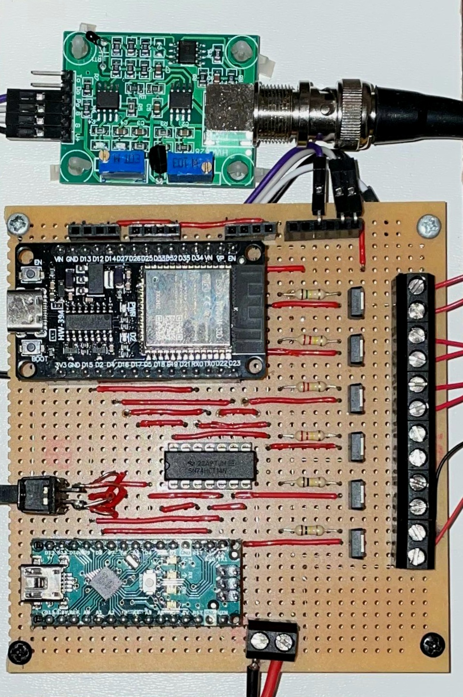

# Pumpen Ansteuerung

Das System nutzt kleine 3-5V Pumpen, diese werden mit P-Kanal Mosfets angesteuert.
Für ein normally off Verhalten wird die Gate Spannung der Mosfets von einem Inverter Baustein gesteuert. 
Aufgrund des 5V Logik Levels des Inverters wurde zusätzlich ein Arduino Nano hinzugefügt, welcher mit seinen 5V Ausgängen die Mosfets über den Inverter ansteuert. 
Die Kommandos zum Schalten erhält der Arduino über die UART Schnittstelle vom ESP32, die Verbindung zwischen den beiden Mikrocontrollern kann mit einem Schalter unterbrochen werden, was zum Programmieren der MCUs nötig ist.
Alle Komponenten wurden auf einer Lochrasterplatine platziert, auf welcher zusätzlich Sockel für den PH Sensor und drei Ultraschall Abstandssensoren vorhanden sind.
Der Schaltplan der Platine ist in diesem Ordner zu finden.

## Hardware

- [Arduino] (https://store.arduino.cc/en-de/products/arduino-nano)
- [Pumpen] (https://www.aliexpress.com/item/1005005796719216.html?spm=a2g0o.order_list.order_list_main.37.133e1802JBKUlo)
- [P-Mosfet] (https://www.infineon.com/cms/en/product/power/mosfet/p-channel/irfu9024n/)
- [Inverter] (https://www.ti.com/product/SN54HCT14)
- [Ultraschallsensor] (https://www.aliexpress.com/item/1005005467178145.html?spm=a2g0o.order_list.order_list_main.32.133e1802JBKUlo)
- [PH-Sensor] (https://www.aliexpress.com/item/32997222048.html?spm=a2g0o.order_list.order_list_main.47.133e1802JBKUlo)
- Widerstände 10k
- Lochrasterplatine

__Beachte: Auch dieser Teil des Projektes befindet sich im Prototypen Stadium, in Zukunft wird die Platine überarbeitet werden, sodass SMD Bauteile eingesetzt werden können.__
