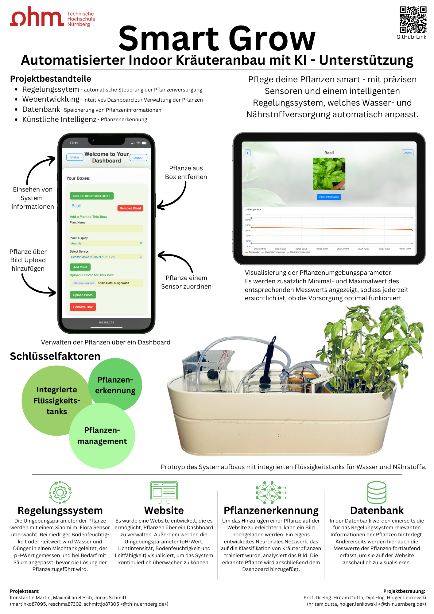

# SmartGrow
Pflege deine Pflanzen smart - mit präzisen Sensoren und einem intelligenten Regelungssystem, welches Wasser- und Nährstoffversorgung automatisch anpasst.

Bei SmartGrow handel es sich um ein automatisiertes System zum Indoor-Kräuteranbau mit KI-Unterstützung. Es ist ein Projekt, welches im Rahmen des Bachelorstudiengangs Elektro- und Informationstechnik an der Technischen Hochschule Nürnberg Georg Simon Ohm entstanden ist. 

## Bestandteile des Projekts
- Regelungssystem:
  
  Im Ordner ControlSystem ist Sourcecode sowie Dokumentation zum Regelungssystem zu finden. Dieses besteht aus einer eigens entwickelten Schaltung und Software für ESP-32 und Arduino Nano.
- Webentwicklung:
  
  Im Ordner Webpage findet sich Sourcecode und Dokumentation der entwickelten Website. Sie dient zur Pflanzenverwaltung und zur Visualisierung verschiedener Messwerte. Die Website wird auf einem RaspberryPi betrieben.
- Planzenerkennung:
  
  Im Ordner PlantRecognition findet sich Sourcecode und Dokumentation zum entwickelten Modell zur Pflanzenerkennung. Dieses Modell wird genutzt um auf der Website eine Pflanze mittels Bild-Upload hinzuzufügen.

## Projektvorstellung

